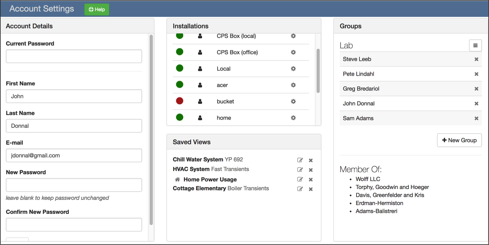
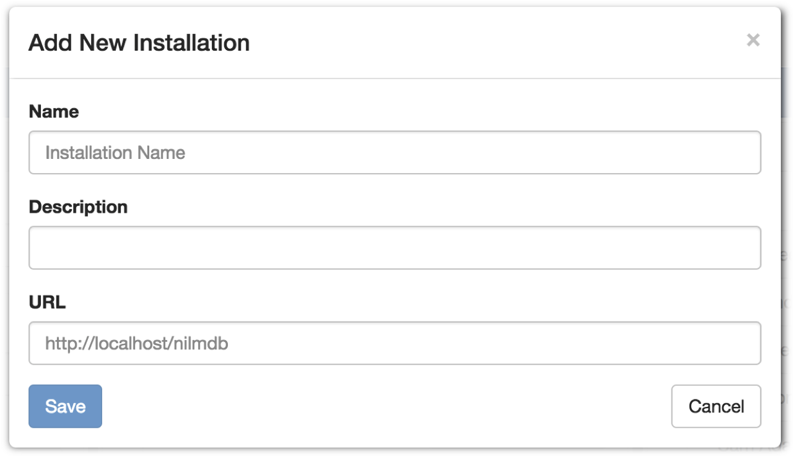
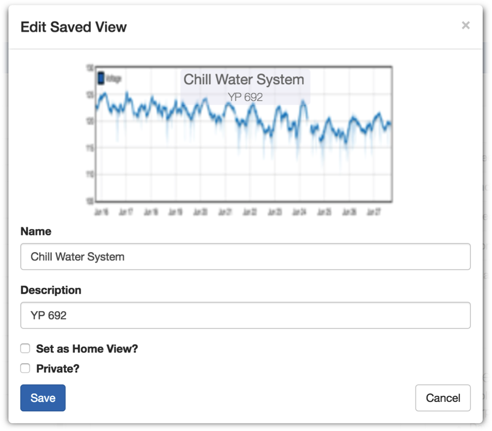
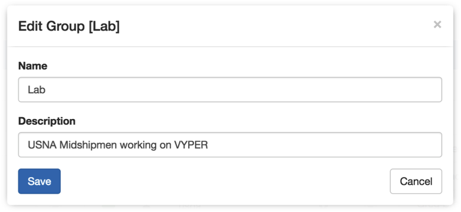
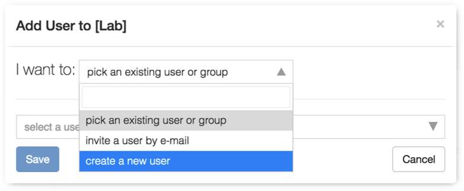
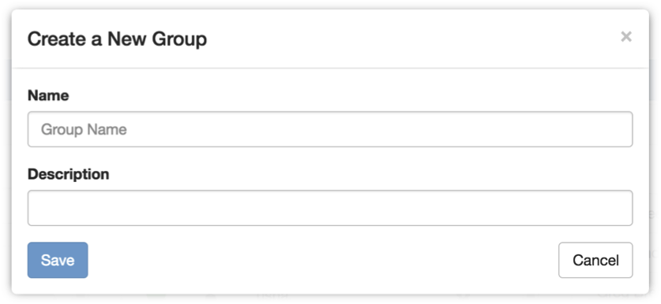

Account Settings
================

Access the Account Settings page by clicking the |my-account| button on the page header.

Account Details
---------------
The Account Details panel allows you to change your name, e-mail, and password.
Any changes require you to enter your current password.

Installations
-------------

Installations are listed by row. Two status icons indicate whether the installation
is online and your permission level. The icon legend is below:

+--------------+---------------------------------------------------+
|  Icon        | Description                                       |
+==============+===================================================+
| |fa-online|  | Installation is online and accepting data queries |
+--------------+---------------------------------------------------+
| |fa-offline| | Installation is offline (not available)           |
+--------------+---------------------------------------------------+
| |fa-admin|   | You have administrative priveleges                |
+--------------+---------------------------------------------------+
| |fa-owner|   | You have owner priveleges                         |
+--------------+---------------------------------------------------+
| |fa-viewer|  | You have viewer priveleges                        |
+--------------+---------------------------------------------------+

Installations where you are an admin or owner have a |fa-gear| button. Click
this button open the Installation Settings page.

Add a new installation by clicking the |new-installation| button. This will
display the **Add New Installation Dialog** shown below.

Enter a name, description, and the NilmDB url for the installation. After you
click |save|, the server scans the installation database which may take some time.
Once the scan is complete the dialog will close and the installation will be
added to your list. You are automatically assigned admin rights to the
installation.

Saved Views
-----------

This panel lists your data views. Click the |fa-close| icon to delete a view.
Click the |fa-edit| icon to edit a view. This will open the **Edit Saved View
Dialog** shown below:

You may change the name, description and visibility of the view. You may not
change the thumbnail or any of the data associated with the view.

If **Set as Home View?** is checked this view will load automatically when you
open the web page. The home view is indicated by a |fa-home| icon next to the
view name.

If **Private?** is checked the view will only be available to you. Otherwise it
is available to any user with sufficient permissions on the associated
installations.

Groups
------

Groups make it easier to manage installation permissions for a large  number of
users. This panel lists the groups you own. The |fa-bars| icon next to group
name opens up the group management menu. This menu allows you to edit the group,
add members, or remove the group.

**Edit Group**

This dialog allows you to change the name and description of the group. The
group name must be unique.

**Add Users**

This dialog allows you to add members to the group. You may add a member three
different ways.

* **pick an existing user or group**: If the user already has an
  account you can select their name from a drop down list.
* **invite a user by e-mail**: If the user does not have an account
  you may send them an e-mail invitation. The user will not appear
  in the list until they have accepted the invitation and created an
  account.
* **create a new user**: Create a new account manually

**Create a Group**

Click the |new-group| button to create a new group. Provide a name and
description for the group and click |save|. The group name must be unique.

Groups you are a member of are listed at the bottom of the panel. You may not
edit groups that you do not own.
