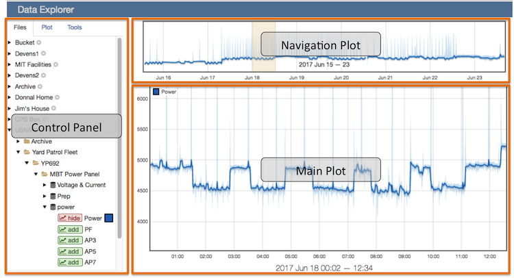
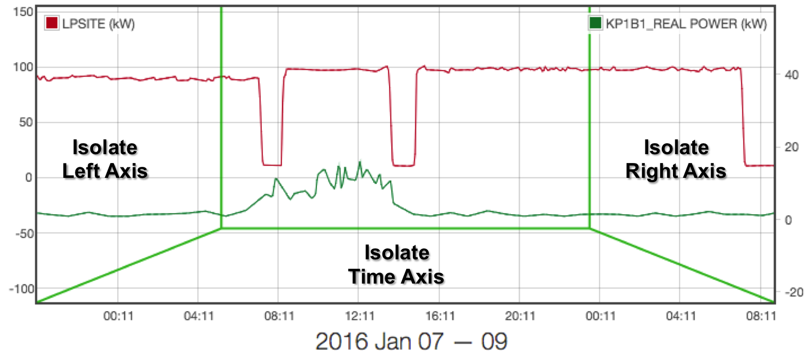
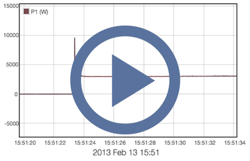
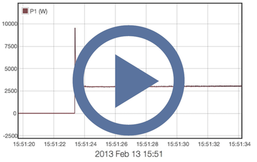
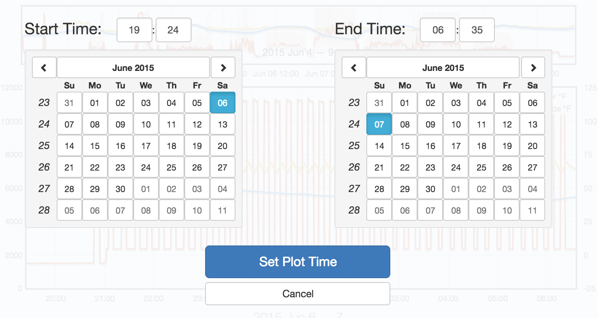
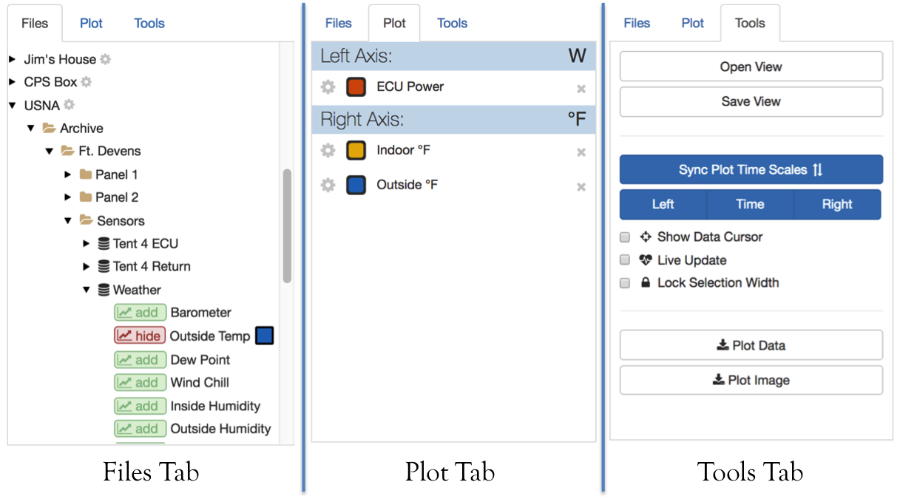
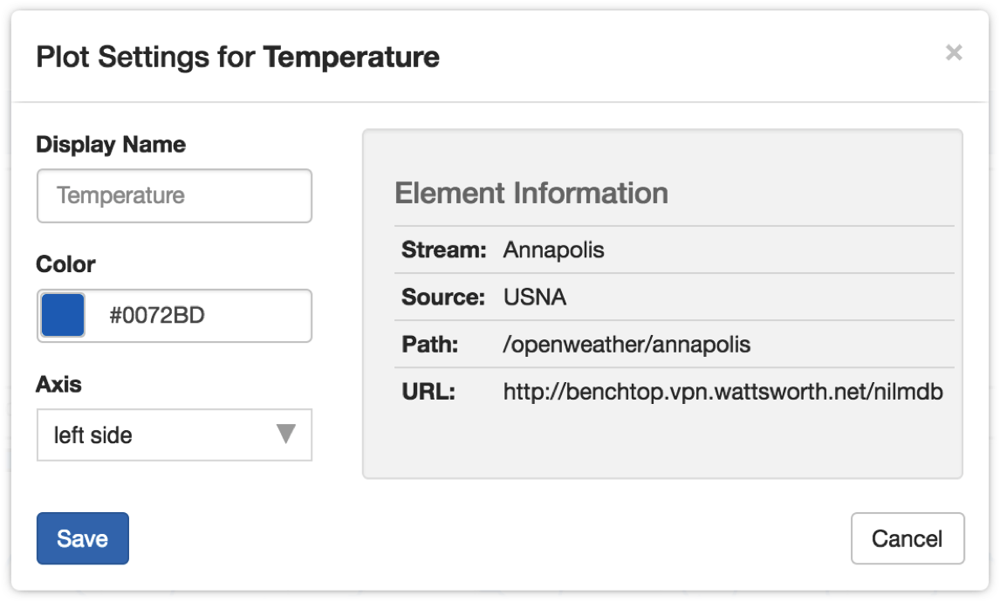
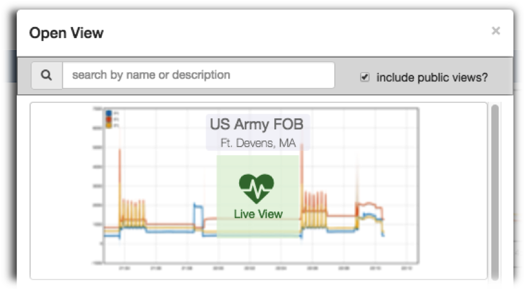
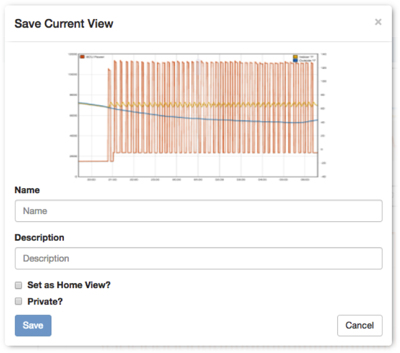
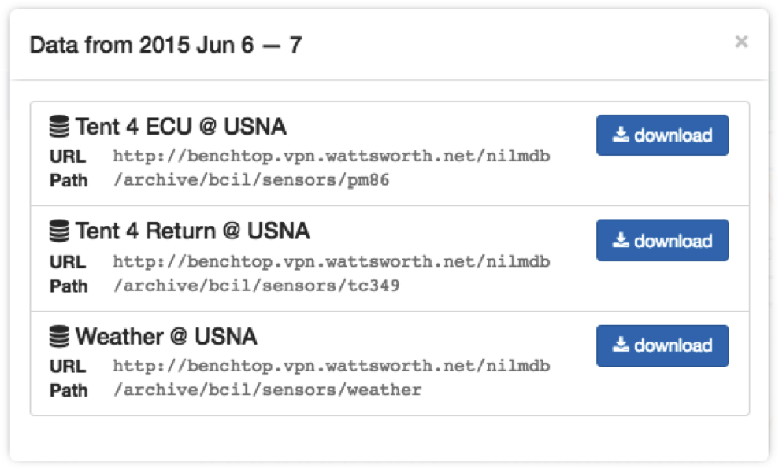

.. raw:: html

    

Data Explorer
=============

Main Plot
---------

The Main Plot interface supports pan and zoom on three axes (left-y, right-y and
time). Click and drag to pan. Scroll or double click to zoom. The plot is
divided into four regions as shown in the figure below. The zoom and pan
controls operate differently depending on the cursor location.

Plot Regions
************

Axis Isolation
***************************

When the cursor is in the center of the plot, pan and zoom operates
simultaneously on all the axes. It is often more intuitive to manipulate one
axis at a time.  To isolate an axis move the cursor towards the desired axis
until it is highlighted.

**Left/Right Y Axes:**

.. rst-class:: click-to-play

Both the left and right y-axes can be isolated. Adjust the offset between left
and right axes by isolating one side and panning up or down.

**Time:**

.. rst-class:: click-to-play

Date Selector
*************

Open the date selector by clicking the date text
below the Main Plot. The selector overlay allows you to specify exact time
bounds for the Main Plot. The Navigation Plot is unaffected.

Plotting Errors
***************

As you interact with the plot, you may encounter error messages like the
following:

.. rst-class:: plot-error
|fa-exclamation-circle| some data could not be retrieved

These errors may occur periodically due to a slow or unreliable connection
with the remote installation. Pan or zoom the plot to retry the request. If
an initial data request fails, the plot may zoom to an incorrect location.
Use the autoscale buttons in the :ref:`explorer-tools-tab` to recenter the plot.

.. rst-class:: plot-warning
|fa-exclamation-triangle| some data cannot be displayed at this resolution

If a continuous or discrete element is not sufficiently decimated or if an event
element has too many samples the plot data will be replaced with a thick line
and an asterix will appear next to the legend entry. Once you have zoomed in
sufficiently the data will reappear. To avoid this problem make sure the data
stream is fully decimated, then refresh the installation database.

Navigation Plot
---------------

The Navigation Plot shows a fixed overview of the data and highlights the
portion displayed in the Main Plot. The y-axis is fixed to the autoscale values
of the data (either the range of the plotted data or the ``Default Max`` and
``Default Min`` of the streams). Click and drag to select the range of
data displayed in the Main Plot.

Control Panel
-------------

The control panel contains three tabs shown above. Use the
:ref:`explorer-files-tab` to select data to plot. Use the
:ref:`explorer-plot-tab` to see the currently plotted elements and customize the
display. Use the :ref:`explorer-tools-tab` to open and save views, download
data, and adjust the plot behavior.

.. _explorer-files-tab:

Files Tab
*********

Each installation is an expandable file tree. Clicking the |fa-caret-right| icon
expands or collapses a node. Expand an installation to see the list of root
folders. Folders contain data streams and/or subfolders. Expand a data stream to
see the list of plottable elements. Add an element to the plot by clicking the
|add-element| button next to the element name. The plot color will appear as a
square patch next to the name.

Remove an element by clicking the |remove-element| button. Elements may only be
plotted on an axis with matching units. If both left and right axes have
elements with other units, the plot button will be disabled. Hover the cursor
over the button to display the required axis units.

If you have owner or administrator rights on an installation, click the
|fa-gear| icon next to the installation name to open the Installation Settings
page.

.. _explorer-plot-tab:

Plot Tab
********

This tab displays the currently plotted elements organized by axis. The axis
headers show the current unit on the righthand side. Hover the cursor over an
element to display the element stream and installation. The format is
``[stream_name] @ [installation_name]``.

Click the |fa-close| icon next to the element entry to remove it from the plot.
When all elements are removed the Plot Tab is disabled.

Click the |fa-gear| icon next to the element entry to bring up the  **Plot
Settings Dialog** shown below:

Customization options are on the left and element information
is displayed on the right. The Path and URL refer to the NilmDB location
where this data is stored. All customizations are local to the browser- they are
not persisted to the database. Customization is available for:

+--------------+-------+-------------------------------------------------------+
|  Option      | Value | Description                                           |
+==============+=======+=======================================================+
| Display Name | Text  | The legend entry, leave empty to use the element name |
+--------------+-------+-------------------------------------------------------+
| Color        | Hex   | Click the color patch or type a custom value          |
+--------------+-------+-------------------------------------------------------+
| Axis         | Left, | Override default axis assignment (units must match)   |
|              | Right |                                                       |
+--------------+-------+-------------------------------------------------------+

.. _explorer-tools-tab:

Tools Tab
*********

This tab displays various plot control options as well as the
:ref:`explorer-dataviews` and :ref:`explorer-download` tools.

.. _explorer-autoscale-axes:

Autoscale Axes
++++++++++++++

These buttons adjust the time and y axis scales for the Main Plot and
Navigation Plot.

+-----------------------+---------------------------------------------+
|  Button               | Description                                 |
+=======================+=============================================+
| |sync-plots|          | Rescale the Navigation Plot time axis to    |
|                       | match the Main Plot                         |
+-----------------------+---------------------------------------------+
| |scale-left|          | Rescale the Main Plot left axis to fit      |
|                       | the data                                    |
+-----------------------+---------------------------------------------+
| |scale-time|          | Rescale the Main Plot time axis fit         |
|                       | all the data                                |
+-----------------------+---------------------------------------------+
| |scale-right|         | Rescale the Main Plot right axis to fit     |
|                       | the data                                    |
+-----------------------+---------------------------------------------+

Data Cursor
+++++++++++

Display the plot value when the cursor is hovering over a datapoint in the Main Plot.

Live Update
+++++++++++

When checked the plots are synced to the current time. The Navigation Plot
displays the last hour and the Main Plot displays the last twenty minutes. If
the plotted elements have no data over this interval the plots will be empty.

The plots automatically refresh to track the current time. To stop the auto
refresh clear the checkbox or click the |fa-close| icon on the |live-update|
label at the bottom of the Main Plot.

Lock Selection Width
++++++++++++++++++++

When checked the Navigation Plot selection is locked to a fixed width. Click
and drag to pan the selection along the time axis.

When unchecked the Navigation Plot selection is variable width. Click and drag
to scale the selection along the time axis.

Data Envelope
+++++++++++++

When checked the maximum and minimum bounds are displayed as shaded regions
around the data mean. This shows the envelope of the data even though not all of
the samples are available to plot.

When unchecked only the mean of the data is plotted. This setting does not affect
plots where the resolution is high enough to show the raw samples.

.. _explorer-dataviews:

Data Views
----------

Data views are saved plots that can be shared between users. Users may only
open views if they have permissions on all the datasets used in the view. The open/save
buttons are located at the top of the :ref:`explorer-tools-tab`.

Open View
*********

Click |open-view| to display the **Open View** dialog. This dialog lists all available
data views. If you do not see a view you are expecting check to make sure you
have permissions on all the installations involved with the view.

The search bar at the top of the dialog filters views by title and description.
It updates as you type.

Clear the **include public views?** check box to show only the views you have
created. Views that are locked to the current time have a |live-update| label
superimposed on the plot thumbnail. Click a thumbnail to load the view onto the
plot. This will hide any currently plotted elements.

Save View
*********

Click |save-view| to display the **Save Current View** dialog. This dialog
allows you to save the current plot so you can reload it later. See the
:ref:`explorer-download` section for saving the plot data to your local
computer.

The Main Plot is used as the thumbnail image. The name is required and the description
is optional.

Click **Set as Home View?** to automatically load this dataview when you open the
website. This setting can be updated from the Account Page.

Click **Private?** to hide the view from other users. The view will always
be hidden from users who do not have permission on the datasets regardless of
the check box setting.

.. _explorer-download:

Download
--------

You can download the plot image as a high resolution png file or download the
datasets directly. The download tools are located in the :ref:`explorer-tools-tab`.

Image
*****

Click the |plot-image| button to display a png image of the Main Plot. The
picture resolution matches your display. To generate a higher resolution use the
browser controls to zoom out on the web page before clicking the download
button.

Data
****

Click the |plot-data| button to display the **Data Download Dialog** shown
below. Streams with plotted elements are listed along with details about the
NilmDB location (URL and path).

Click |download-data| to download the selected stream over the time
range displayed in the Main Plot. The data will be decimated to fit within
the maximum resolution of the host installation. For example if the
installation has a maximum resolution of 3000, the downloaded dataset will have
3000 points or less. The data format is designed to be loaded into MATLAB or
Excel. Instructions for loading the data into MATLAB are included in the file
header along with information about the data source, time range, and elements.
The file name referes to the selected date range as ``hhmm_DDMMYYYY__to__hhmm_DDMMYY``.

**Download Example**: ``0725_28Sep2010__to__0811_14Apr2020.txt``::

  ###############################################
  # Stream: Weather
  # Installation: USNA (USNA Datasets)
  # Path:   /archive/bcil/sensors/weather
  # URL: http://benchtop.vpn.wattsworth.net/nilmdb
  #
  # start:             2010-09-28 07:25:29 -0400
  # end:               2020-04-14 08:11:07 -0400
  # total time:        over 9 years
  # total rows:        1163
  # decimation factor: 1024
  # notes:
  # legend:
  #                    Column 1: time (us)
  #                    Column 2: Barometer (none)
  #                    Column 3: Outside Temp (°F)
  #                    Column 4: Dew Point (none)
  #                    Column 5: Wind Chill (none)
  #                    Column 6: Inside Humidity (none)
  #                    Column 7: Outside Humidity (none)
  #
  # --------- MATLAB INSTRUCTIONS ------------
  #
  # this file can be loaded directly into MATLAB
  #
  #   >> x = importdata('~/Downloads/filename.csv')
  #   x =
  #       data: [1737x15 double] % the data
  #   textdata: {41x1 cell}      % this help text
  #
  # --------- NILMTOOL INSTRUCTIONS ----------
  #
  # raw data can be accessed using nilmtool, run:
  #
  # $> nilmtool -u http://benchtop.vpn.wattsworth.net/nilmdb extract -s @1285673129971000 -e @1586866267264000 /archive/bcil/sensors/weather
  #
  # ------------------------------------------
  #
  1322857034602538, 30.24609, 47.51152, 28.41116, 46.0334,  34.15723, 47.46582
  1322867909921874, 30.31547, 43.41709, 30.82982, 42.68623, 38.76562,60.99707
  1322878231684569, 30.39615, 40.28399, 28.69991, 39.25175, 40.0, 63.2002
  ...more data...
