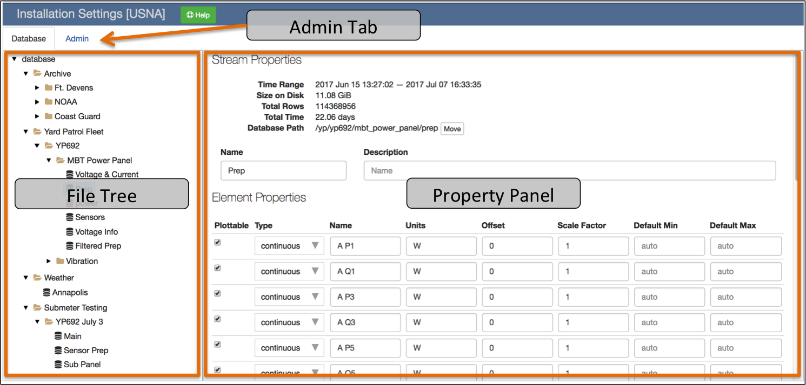
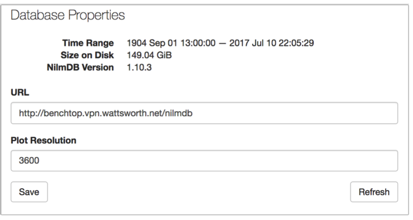
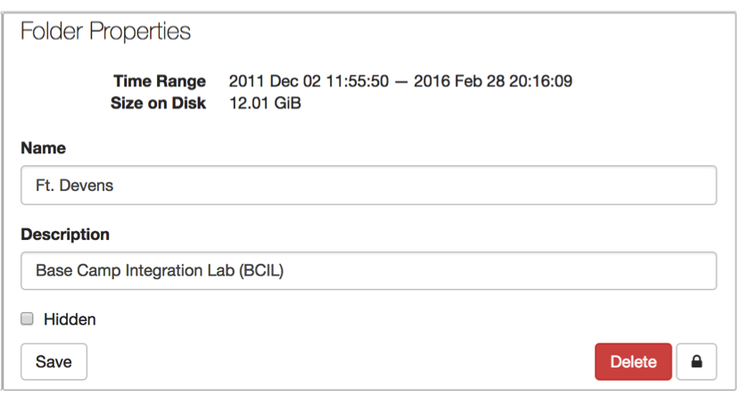
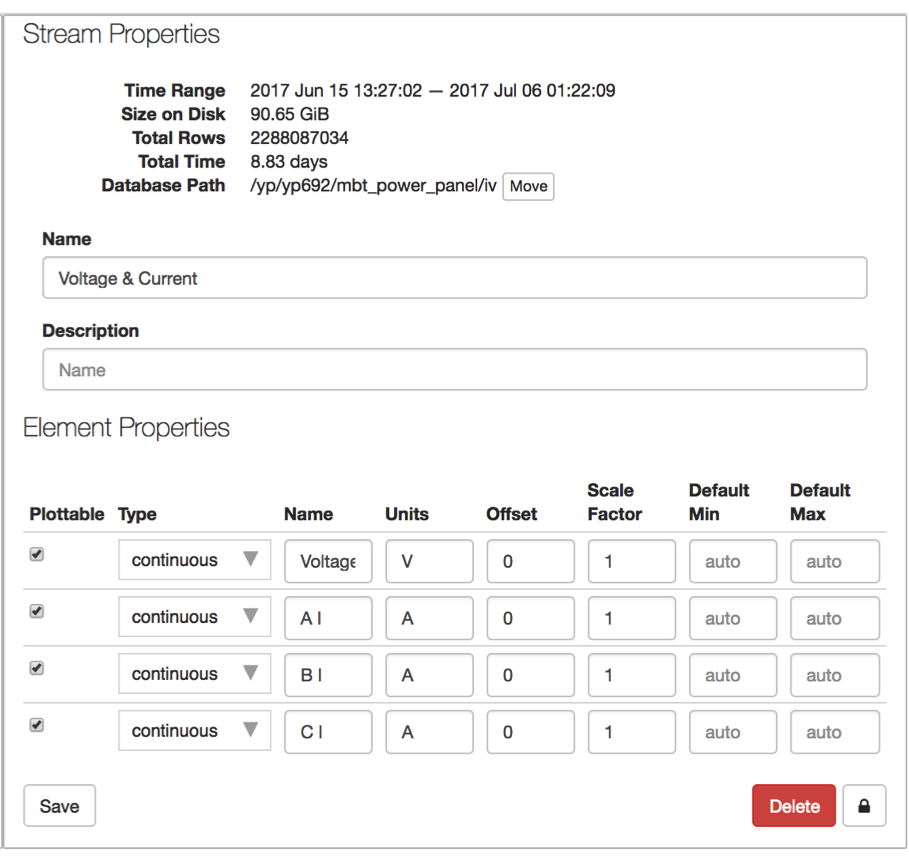
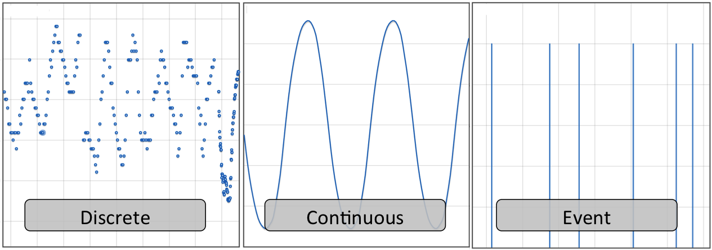
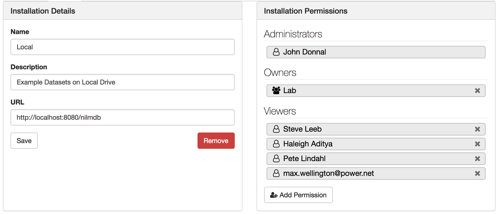
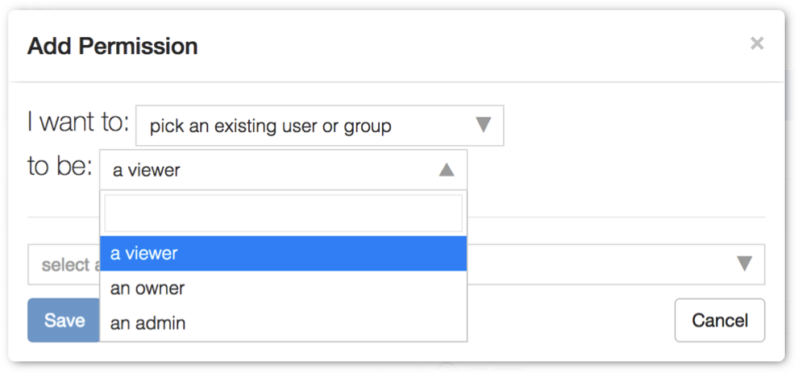
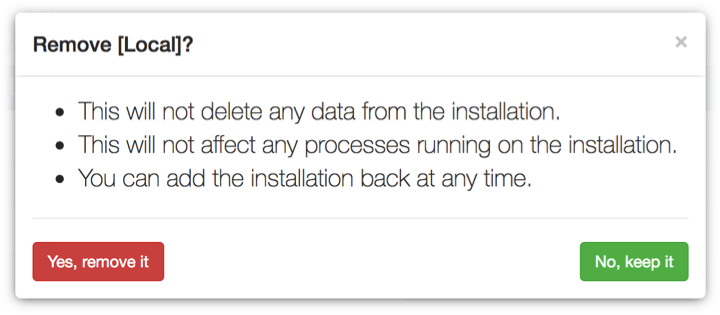

Installation Settings
=====================

File Tree
---------

When the page is loaded only the installation database and root folders are
listed. Click the |fa-caret-right| icon to expand or collapse a folder. Folders
contain data streams and/or subfolders. Select an item to display it in the
Property Panel. You may display the :ref:`installation-database`, a
:ref:`installation-folder`, or a :ref:`installation-stream`.

Property Panel
--------------

The property panel lists the attributes and settings for the currently selected
item in the File Tree.

.. _installation-database:

Database
++++++++

.. _installation-folder:

Folder
++++++

.. _installation-stream:

Stream
++++++

Admin Tab
---------

